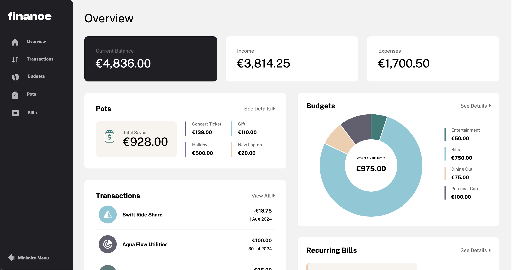

# Stash

Stash is a comprehensive application (in the making) designed to help users manage their finances efficiently.

It is created as a portfolio application to showcase my ability as a full stack developer to potential employers.

---

## Table of Contents

1. [Overview](#overview)
2. [Tech Stack](#techstack)
3. [Features](#features)
4. [Installation](#installation)
5. [Usage](#usage)
6. [Screenshots](#screenshots)
7. [Contributing](#contributing)
8. [License](#license)
9. [Contact](#contact)

---

## Overview

This is a web-based application that helps users to centrally manage their finances efficiently using modern React and Node.js technologies.

---

## Tech Stack

This is a web-based application that helps users to centrally manage their finances efficiently using modern React and Node.js technologies.

---

## Features

- View all personal finance data at-a-glance on the Overview page.
  Perform full CRUD operations (Create, Read, Update, Delete) for budgets and saving pots.
- View the latest three transactions for each budget category.
- Track progress towards saving goals for each pot.
- Add and withdraw money from saving pots effortlessly.
- Enjoy an optimal layout for the interface on any device,

---

## Installation

Provide step-by-step instructions on how to set up the project locally.

Example:

1. Clone the repository:
   ```bash
   git clone https://github.com/username/project-name.git
   ```
2. Navigate to the project directory:
   ```bash
   cd project-name
   ```
3. Install dependencies:
   ```bash
   npm install
   ```
4. Start the development server:
   ```bash
   npm start
   ```

---

## Usage

Describe how to use the project. Include examples, code snippets, or commands to demonstrate functionality.

Example:
"To log in, use the default credentials provided in the seed data, or register for a new account."

---

## Screenshots


---

## Contributing

1. Fork the repository.
2. Create a new branch:
   ```bash
   git checkout -b feature-name
   ```
3. Commit your changes:
   ```bash
   git commit -m 'Add feature'
   ```
4. Push to the branch:
   ```bash
   git push origin feature-name
   ```
5. Create a pull request.

---

## License

This project is licensed under the MIT License.

---

## Contact

For any inquiries, please reach out at:

- **LinkedIn**: [in/arunpariyar](https://linkedin.com/in/arunpariyar)
- **GitHub**: [arunpariyar](https://github.com/arunpariyar)
